<p align="center">
    
</p>

JavaScript Essential exercise for Beginners
=====================
JavaScript exercise/examples for Beginners
=====================

## 01. What is JavaScript?

- JavaScript is a programming language that adds interactivity to Web pages
- JavaScript is a scripting language
- A JavaScript script is a program that is included on an HTML page
- JavaScript scripts are text on Web pages that are interpreted and run by Web browsers
- JavaScript is initially named and developed as `LiveScript` at Netscape Navigator Corporation
- JavaScript is `not Java`
- Due to Java wave or Java popularity and buzz, `LiveScript` renamed to `JavaScript`

## 02. What can JavaScript do?

- Create an active User Interface
- Control the user experience based on Day, Date, Time and Browser, etc
- Validate user input on forms
- Create custom HTML pages on the fly/dynamically
- Control Web browsers interactivity and behaviors

## 03. What can't JavaScript do?

- JavaScript can't talk to a Database (Its possible with NodeJs)
- JavaScript can't write to files (Its possible with NodeJs)
- Keep track of state (except with cookies)

Topics include
=====================
1. [Example 1 - swapping variables](#example-1-swapping-variables)
2. [Example 2 - max number](#example-2-max-number)
3. [Example 3 - Landscape Portrait](#example-3-landscape-portrait)
4. [Example 4 - FizzBuzz Algorithms](#example-4-fizzbuzz-algorithms)
5. [Example 5 - Speed Limits](#example-5-speed-limits)
6. [Example 6 - Odd Even Number Loop](#example-6-odd-even-number-loop)
7. [Example 7 - Count Truthy Falsy Values](#example-7-count-truthy-falsy-values)
8. [Example 8 - Object String Properties Key](#example-8-object-string-properties-key)
9. [Example 9 - Sum of Multiples](#example-9-sum-of-multiples)
10. [Example 10 - Netsted Loop Star Pattern](#example-10-netsted-loop-star-pattern)
11. [Example 11 - Marks Average Grade](#example-11-marks-average-grade)
12. [Example 12 - Random Bingo Card](#example-12-random-bingo-card)
13. [Example 13 - Show Prime Numbers](#example-13-show-prime-numbers)
14. [Example 14 - Sum Of Arguments](#example-14-sum-of-arguments)
15. [Example 15 - Sum Of Arguments Array](#example-15-sum-of-arguments-array)
16. [Example 16 - Circle Area Object Read Only Property](#example-16-circle-area-object-read-only-property)
17. [Example 17 - Create Array From Argument Range](#example-17-create-array-from-argument-range)
18. [Example 18 - Array Includes Element Exists](#example-18-array-includes-element-exists)
19. [Example 19 - Array Excludes Value To New Array](#example-19-array-excludes-value-to-new-array)
20. [Example 20 - Array Count Search Occurances](#example-20-array-count-search-occurances)
21. [Example 21 - Array Get Max Largest Number](#example-21-array-get-max-largest-number)
22. [Example 22 - Array Filter Sort Map](#example-22-array-filter-sort-map)
23. [Example 23 - Object Create Students and Address Object](#example-23-object-create-students-and-address-object)
24. [Example 24 - Object Create Object Factory Constructor Function](#example-24-object-create-object-factory-constructor-function)
25. [Example 25 - Object Equality](#example-25-object-equality)

Example 1 swapping variables
=====================

<p>
  <figure>
    &nbsp;&nbsp;&nbsp; 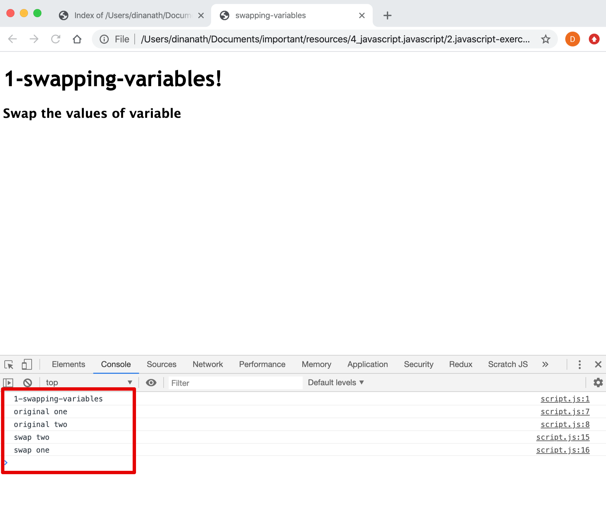
    <figcaption>&nbsp;&nbsp;&nbsp; Image 1 - Swapping Variables</figcaption>
  </figure>
</p>

> **Syntax & Example**: `1-swapping-variables.html`
```html

<!DOCTYPE html>
<html lang="en">
<head>
  <meta charset="UTF-8">
  <meta name="viewport" content="width=device-width, initial-scale=1.0">
  <title>swapping-variables</title>
  <link rel="stylesheet" type="text/css" href="../style.css" />
</head>
<body> 
  
  <h1>1-swapping-variables!</h1>

  <h3>Swap the values of variable</h3>
  
  <script type="text/javascript" src="script.js"></script>

</body>
</html>

```

> **Syntax & Example**: `script.js`
```js

console.log('1-swapping-variables');

let value1 = 'one';
let value2 = 'two';

// original values
console.log('original', value1);
console.log('original', value2);

// swapping values
let value3 = value1;
value1 = value2;
value2 = value3;

console.log('swap', value1);
console.log('swap', value2);

```

> **Syntax & Example**: global `style.css`
```css

body{
  font-family: 'Lucida Sans', 'Lucida Sans Regular', 'Lucida Grande', 'Lucida Sans Unicode', Geneva, Verdana, sans-serif;
}

h1, th{
  font-family: 'Trebuchet MS', 'Lucida Sans Unicode', 'Lucida Grande', 'Lucida Sans', Arial, sans-serif;
}

table{
  /* border: 2px solid #696969;
  border-collapse: collapse; */
  font-size: 18px;
}

th{
  width: 20%;
}

th, td{
  padding: 10px;
  border: 2px solid #696969;
  text-align: center;
}

#freeSquare{
  background-color: coral;
}

```

Example 2 max number
=====================

<p>
  <figure>
    &nbsp;&nbsp;&nbsp; 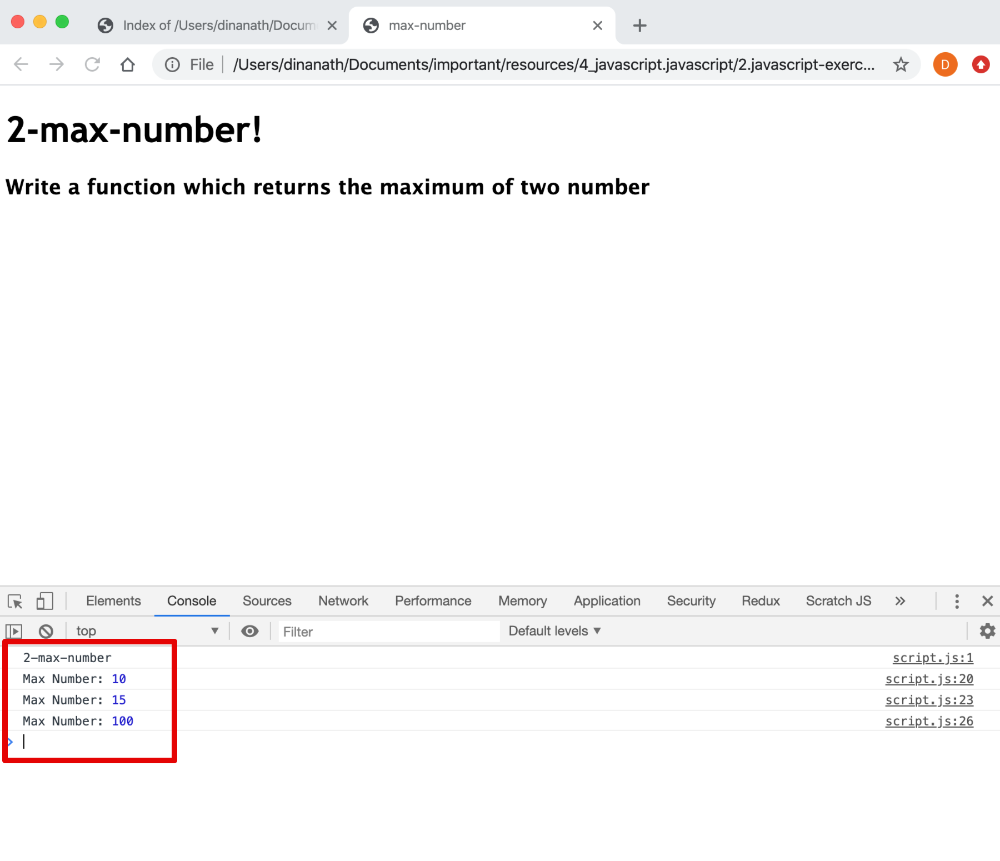
    <figcaption>&nbsp;&nbsp;&nbsp; Image 2 - Max Number</figcaption>
  </figure>
</p>

> **Syntax & Example**: `2-max-number.html`
```html

<!DOCTYPE html>
<html lang="en">
<head>
  <meta charset="UTF-8">
  <meta name="viewport" content="width=device-width, initial-scale=1.0">
  <title>max-number</title>
  <link rel="stylesheet" type="text/css" href="../style.css" />
</head>
<body> 
  
  <h1>2-max-number!</h1>

  <h3>Write a function which returns the maximum of two number</h3>
  
  <script type="text/javascript" src="script.js"></script>

</body>
</html>

```

> **Syntax & Example**: `script.js`
```js

console.log('2-max-number');

function findMaxNumber(num1, num2){
  // 1. long syntax
  /* if(num1 > num2){
    return num1
  } else {
    return num2
  } */

  // 2. short syntax
  /* if(num1 > num2) return num1;
  else return num2; */

  // 3. ternary short syntax
  return (num1 > num2) ? num1 : num2;
}

let checkMax1 = findMaxNumber(10, 5);
console.log('Max Number:',checkMax1);

let checkMax2 = findMaxNumber(10, 15);
console.log('Max Number:',checkMax2);

let checkMax3 = findMaxNumber(100, 100);
console.log('Max Number:',checkMax3);

```

Example 3 Landscape Portrait
=====================

<p>
  <figure>
    &nbsp;&nbsp;&nbsp; 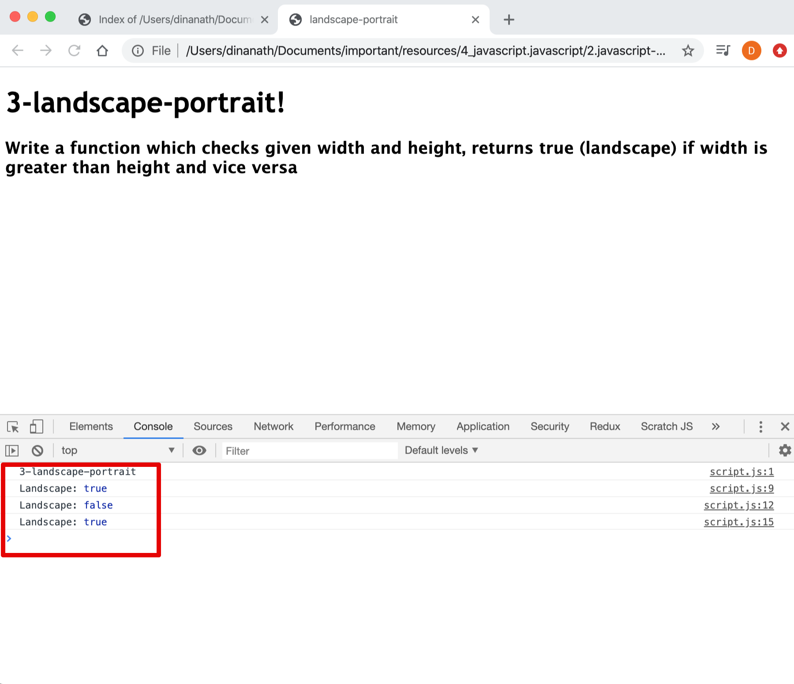
    <figcaption>&nbsp;&nbsp;&nbsp; Image 3 - Landscape Portrait</figcaption>
  </figure>
</p>

> **Syntax & Example**: `3-landscape-portrait.html`
```html

<!DOCTYPE html>
<html lang="en">
<head>
  <meta charset="UTF-8">
  <meta name="viewport" content="width=device-width, initial-scale=1.0">
  <title>landscape-portrait</title>
  <link rel="stylesheet" type="text/css" href="../style.css" />
</head>
<body> 
  
  <h1>3-landscape-portrait!</h1>

  <h3>Write a function which checks given width and height, returns true (landscape) if width is greater than height and vice versa</h3>
  
  <script type="text/javascript" src="script.js"></script>

</body>
</html>

```

> **Syntax & Example**: `script.js`
```js

console.log('3-landscape-portrait');

function isLandscape(width, height){
  // 3. ternary short syntax
  return (width > height);
}

let checkWidthHeight1 = isLandscape(800, 600);
console.log('Landscape:',checkWidthHeight1);

let checkWidthHeight2 = isLandscape(600, 800);
console.log('Landscape:',checkWidthHeight2);

let checkWidthHeight3 = isLandscape(1024, 768);
console.log('Landscape:',checkWidthHeight3);

```

Example 4 FizzBuzz Algorithms
=====================

<p>
  <figure>
    &nbsp;&nbsp;&nbsp; 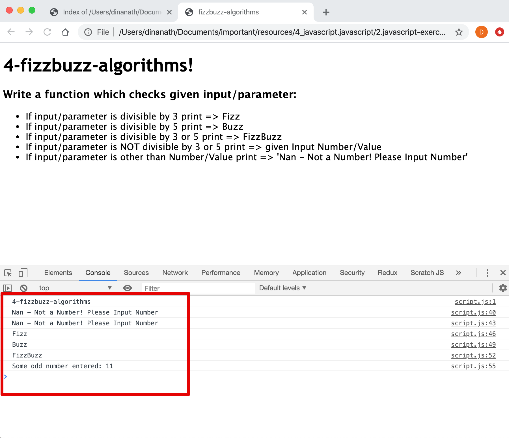
    <figcaption>&nbsp;&nbsp;&nbsp; Image 4 - Ffizzbuz Algorithms</figcaption>
  </figure>
</p>

> **Syntax & Example**: `4-fizzbuzz-algorithms.html`
```html

<!DOCTYPE html>
<html lang="en">
<head>
  <meta charset="UTF-8">
  <meta name="viewport" content="width=device-width, initial-scale=1.0">
  <title>fizzbuzz-algorithms</title>
  <link rel="stylesheet" type="text/css" href="../style.css" />
</head>
<body> 
  
  <h1>4-fizzbuzz-algorithms!</h1>

  <h3>Write a function which checks given input/parameter:</h3>
  
  <ul>
    <li>If input/parameter is divisible by 3 print => Fizz</li>
    <li>If input/parameter is divisible by 5 print => Buzz</li>
    <li>If input/parameter is divisible by 3 or 5 print => FizzBuzz</li>
    <li>If input/parameter is NOT divisible by 3 or 5 print => given Input Number/Value</li>
    <li>If input/parameter is other than Number/Value print => 'Nan - Not a Number! Please Input Number' </li>
  </ul>
  
  <script type="text/javascript" src="script.js"></script>

</body>
</html>

```

> **Syntax & Example**: `script.js`
```js

console.log('4-fizzbuzz-algorithms');

/* 
<h3>Write a function which checks given input/parameter:</h3>

<ul>
  <li>If input/parameter is divisible by 3 print => Fizz</li>
  <li>If input/parameter is divisible by 5 print => Buzz</li>
  <li>If input/parameter is divisible by 3 or 5 print => FizzBuzz</li>
  <li>If input/parameter is NOT divisible by 3 or 5 print => given Input Number/Value</li>
  <li>If input/parameter is other than Number/Value print => 'Nan - Not a Number! Please Input Number' </li>
</ul>
*/

function isfizzBuzz(arg){
  if(typeof arg !== 'number'){
    return ('Nan - Not a Number! Please Input Number');
  }

  if((arg % 3 === 0) && (arg % 5 === 0)) {
    return 'FizzBuzz';
  }

  if(arg % 3 === 0) {
    return 'Fizz';
  }

  if(arg % 5 === 0) {
    return 'Buzz';
  }

  else {
    return 'Some odd number entered: ' + arg;
  }

}

let checkFizzBuzz1 = isfizzBuzz('one');
console.log(checkFizzBuzz1);

let checkFizzBuzz2 = isfizzBuzz(true);
console.log(checkFizzBuzz2);

let checkFizzBuzz3 = isfizzBuzz(9);
console.log(checkFizzBuzz3);

let checkFizzBuzz4 = isfizzBuzz(10);
console.log(checkFizzBuzz4);

let checkFizzBuzz5 = isfizzBuzz(30);
console.log(checkFizzBuzz5);

let checkFizzBuzz6 = isfizzBuzz(11);
console.log(checkFizzBuzz6);

```

Example 5 Speed Limits
=====================

<p>
  <figure>
    &nbsp;&nbsp;&nbsp; 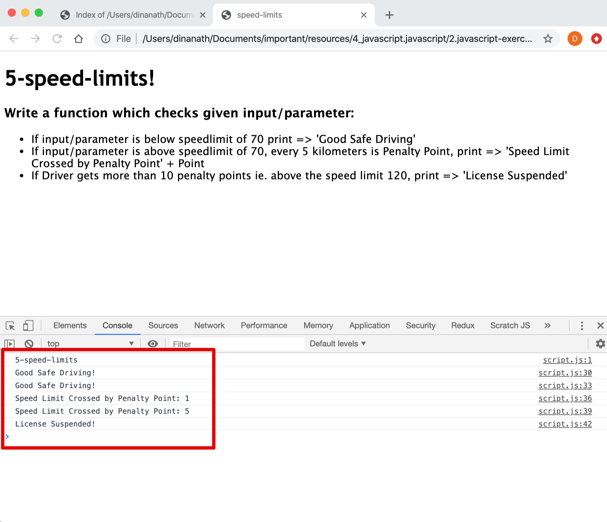
    <figcaption>&nbsp;&nbsp;&nbsp; Image 5 - Speed Limits</figcaption>
  </figure>
</p>

> **Syntax & Example**: `5-speed-limits.html`
```html

<!DOCTYPE html>
<html lang="en">
<head>
  <meta charset="UTF-8">
  <meta name="viewport" content="width=device-width, initial-scale=1.0">
  <title>speed-limits</title>
  <link rel="stylesheet" type="text/css" href="../style.css" />
</head>
<body> 
  
  <h1>5-speed-limits!</h1>

  <h3>Write a function which checks given input/parameter:</h3>
  
  <ul>
    <li>If input/parameter is below speedlimit of 70 print => 'Good Safe Driving'</li>
    <li>If input/parameter is above speedlimit of 70, every 5 kilometers is Penalty Point, print => 'Speed Limit Crossed by Penalty Point' + Point </li>
    <li>If Driver gets more than 10 penalty points ie. above the speed limit 120, print => 'License Suspended'</li>
  </ul>
  
  <script type="text/javascript" src="script.js"></script>

</body>
</html>

```

> **Syntax & Example**: `script.js`
```js

console.log('5-speed-limits');

/* 
<h3>Write a function which checks given input/parameter:</h3>
  
<ul>
  <li>If input/parameter is below speedlimit of 70 print => 'Good Safe Driving'</li>
  <li>If input/parameter is above speedlimit of 70, every 5 kilometers is Penalty Point, print => 'Speed Limit Crossed by Penalty Point' + Point </li>
  <li>If Driver gets more than 10 penalty points ie. above the speed limit 120, print => 'License Suspended'</li>
</ul>
*/

const SPEEDLIMIT = 70;
const KMPERPOINT = 5;

function checkSpeedLimit(curSpeed) {
  if (curSpeed <= SPEEDLIMIT) {
    return ('Good Safe Driving!');
  } else {
    let penaltyPoint = Math.floor((curSpeed - SPEEDLIMIT) / KMPERPOINT);
    if (penaltyPoint < 10) {
      return ('Speed Limit Crossed by Penalty Point: ' + penaltyPoint);
    } else {
      return ('License Suspended!');
    }
  }
}

let checkPoin1 = checkSpeedLimit(40);
console.log(checkPoin1);

let checkPoin2 = checkSpeedLimit(70);
console.log(checkPoin2);

let checkPoin3 = checkSpeedLimit(75);
console.log(checkPoin3);

let checkPoin4 = checkSpeedLimit(99);
console.log(checkPoin4);

let checkPoin5 = checkSpeedLimit(120);
console.log(checkPoin5);

```

Example 6 Odd Even Number Loop
=====================

<p>
  <figure>
    &nbsp;&nbsp;&nbsp; 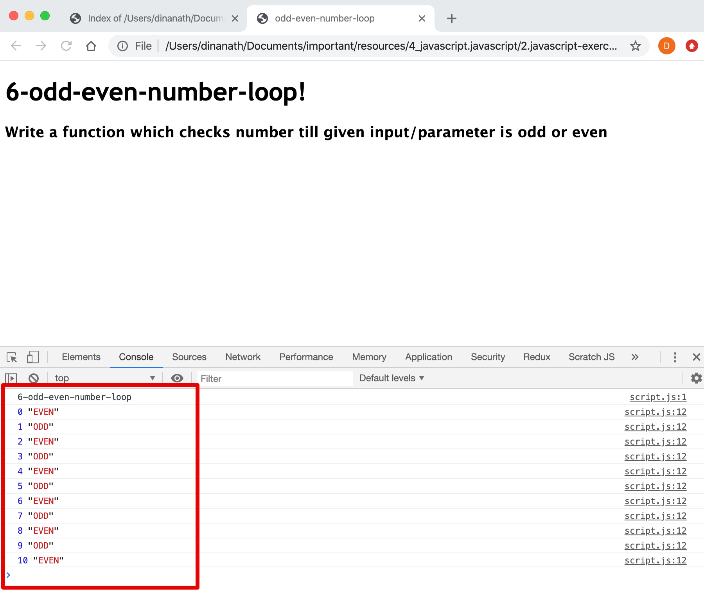
    <figcaption>&nbsp;&nbsp;&nbsp; Image 6 - Odd Even Number Loop</figcaption>
  </figure>
</p>

> **Syntax & Example**: `6-odd-even-number-loop.html`
```html

<!DOCTYPE html>
<html lang="en">
<head>
  <meta charset="UTF-8">
  <meta name="viewport" content="width=device-width, initial-scale=1.0">
  <title>odd-even-number-loop</title>
  <link rel="stylesheet" type="text/css" href="../style.css" />
</head>
<body> 
  
  <h1>6-odd-even-number-loop!</h1>

  <h3>Write a function which checks number till given input/parameter is odd or even</h3>

  <script type="text/javascript" src="script.js"></script>

</body>
</html>

```

> **Syntax & Example**: `script.js`
```js

console.log('6-odd-even-number-loop');

function isOddEvenNumber(curLimit) {
  for(let i = 0; i <= curLimit; i++) {
    /* if (i % 2 === 0) {
      console.log(i , 'EVEN');
    } else {
      console.log(i , 'ODD');
    } */

    const alertMessage = (i % 2 === 0) ? 'EVEN' : 'ODD';
    console.log(i , alertMessage);
  }
}

isOddEvenNumber(10);
// isOddEvenNumber(17);

```

Example 7 Count Truthy Falsy Values
=====================

<p>
  <figure>
    &nbsp;&nbsp;&nbsp; 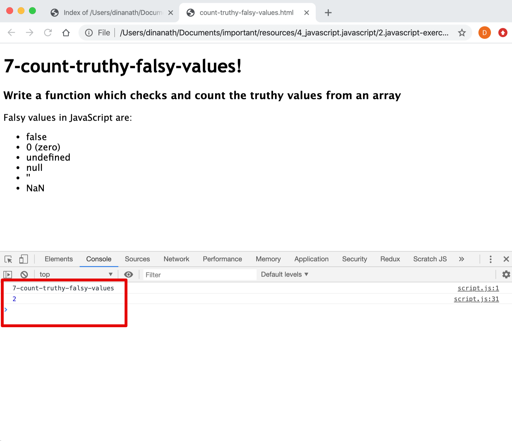
    <figcaption>&nbsp;&nbsp;&nbsp; Image 7 - Count Truthy Falsy Values</figcaption>
  </figure>
</p>

> **Syntax & Example**: `7-count-truthy-falsy-values.html`
```html

<!DOCTYPE html>
<html lang="en">
<head>
  <meta charset="UTF-8">
  <meta name="viewport" content="width=device-width, initial-scale=1.0">
  <title>count-truthy-falsy-values.html</title>
  <link rel="stylesheet" type="text/css" href="../style.css" />
</head>
<body> 
  
  <h1>7-count-truthy-falsy-values!</h1>

  <h3>Write a function which checks and count the truthy values from an array</h3>

  Falsy values in JavaScript are:
  <ul>
    <li>false</li>
    <li>0 (zero)</li>
    <li>undefined</li>
    <li>null</li>
    <li>''</li>
    <li>NaN</li>
  </ul>

  <script type="text/javascript" src="script.js"></script>

</body>
</html>

```

> **Syntax & Example**: `script.js`
```js

console.log('7-count-truthy-falsy-values');

/*
<h3>Write a function which checks and count the truthy values from an array</h3>

Falsy values in JavaScript are:
<ul>
  <li>false</li>
  <li>0 (zero)</li>
  <li>undefined</li>
  <li>null</li>
  <li>''</li>
  <li>NaN</li>
</ul>
*/

const valuesArray = [0, 1, '', undefined, false, true];

function checkCountTruthyFalsy(curArray) {
  let truthyCount = 0;
  
  for (let value of curArray) {
    // no need to check if(value !== false || value !== 0 || value !== '' or ...)
    if (value) {
      truthyCount++;
    }
  }
  return truthyCount;
}

console.log(checkCountTruthyFalsy(valuesArray));

```

Example 8 Object String Properties Key
=====================

<p>
  <figure>
    &nbsp;&nbsp;&nbsp; 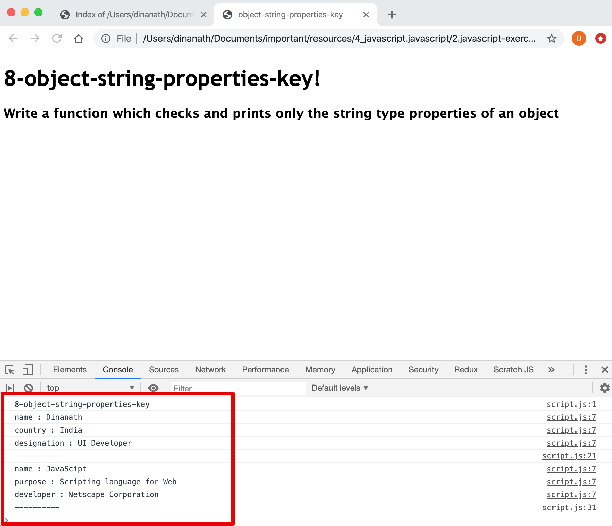
    <figcaption>&nbsp;&nbsp;&nbsp; Image 8 - Object String Properties Key</figcaption>
  </figure>
</p>

> **Syntax & Example**: `8-object-string-properties-key.html`
```html

<!DOCTYPE html>
<html lang="en">
<head>
  <meta charset="UTF-8">
  <meta name="viewport" content="width=device-width, initial-scale=1.0">
  <title>object-string-properties-key</title>
  <link rel="stylesheet" type="text/css" href="../style.css" />
</head>
<body> 
  
  <h1>8-object-string-properties-key!</h1>

  <h3>Write a function which checks and prints only the string type properties of an object</h3>

  <script type="text/javascript" src="script.js"></script>

</body>
</html>

```

> **Syntax & Example**: `script.js`
```js

console.log('8-object-string-properties-key');

function showStringProperties(curObj) {
  for(let key in curObj) {
    // console.log('key/prop:', key);
    if(typeof(curObj[key]) === 'string') {
      console.log(key,':', curObj[key]);
    }
  }
}

const Person = {
  name: 'Dinanath',
  age: 40,
  height: 5.6,
  country: 'India',
  designation: 'UI Developer'
}

showStringProperties(Person);
console.log('----------');

const Technology = {
  name: 'JavaScipt',
  version: 6,
  purpose: 'Scripting language for Web',
  developer: 'Netscape Corporation'
}

showStringProperties(Technology);
console.log('----------');

```

Example 9 Sum of Multiples
=====================

<p>
  <figure>
    &nbsp;&nbsp;&nbsp; 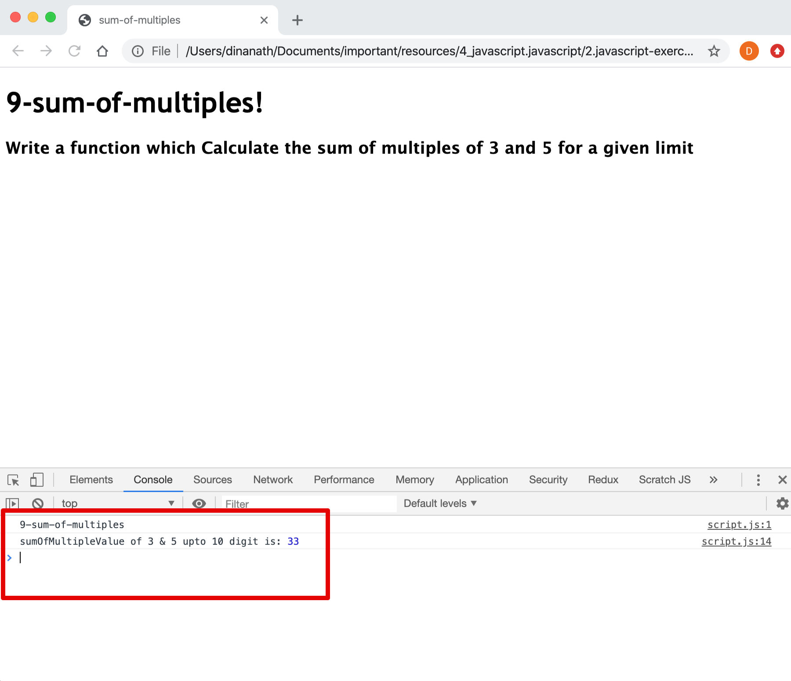
    <figcaption>&nbsp;&nbsp;&nbsp; Image 9 - Sum of Multiples</figcaption>
  </figure>
</p>

> **Syntax & Example**: `9-sum-of-multiples.html`
```html

<!DOCTYPE html>
<html lang="en">
<head>
  <meta charset="UTF-8">
  <meta name="viewport" content="width=device-width, initial-scale=1.0">
  <title>sum-of-multiples</title>
  <link rel="stylesheet" type="text/css" href="../style.css" />
</head>
<body> 
  
  <h1>9-sum-of-multiples!</h1>

  <h3>Write a function which Calculate the sum of multiples of 3 and 5 for a given limit</h3>

  <script type="text/javascript" src="script.js"></script>

</body>
</html>

```

> **Syntax & Example**: `script.js`
```js

console.log('9-sum-of-multiples');

function sumOfMultiples(curLimit) {

  let sumOfMultipleValue = 0;

  for(let i = 0; i <= curLimit; i++) {
    if (i % 3 === 0 || i % 5 === 0) {
      // console.log(i);
      sumOfMultipleValue +=i;
    }
  }
  // return sumOfMultipleValue;
  console.log(`sumOfMultipleValue of 3 & 5 upto ${curLimit} digit is:`, sumOfMultipleValue);
}

sumOfMultiples(10);

```

Example 10 Netsted Loop Star Pattern
=====================

<p>
  <figure>
    &nbsp;&nbsp;&nbsp; 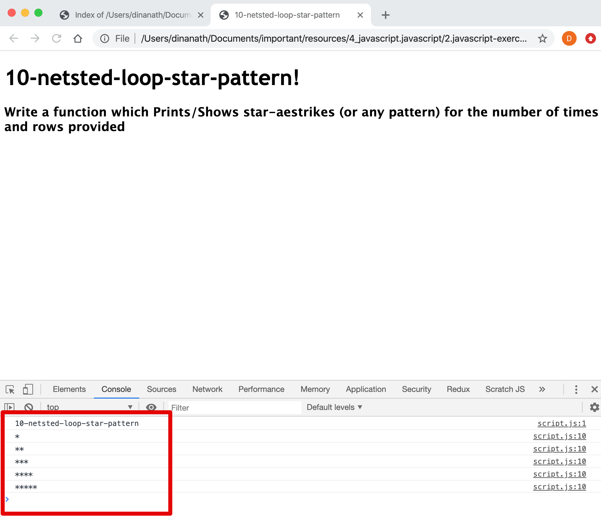
    <figcaption>&nbsp;&nbsp;&nbsp; Image 10 - Netsted Loop Star Pattern</figcaption>
  </figure>
</p>

> **Syntax & Example**: `10-netsted-loop-star-pattern.html`
```html

<!DOCTYPE html>
<html lang="en">
<head>
  <meta charset="UTF-8">
  <meta name="viewport" content="width=device-width, initial-scale=1.0">
  <title>10-netsted-loop-star-pattern</title>
  <link rel="stylesheet" type="text/css" href="../style.css" />
</head>
<body> 
  
  <h1>10-netsted-loop-star-pattern!</h1>

  <h3>Write a function which Prints/Shows star-aestrikes (or any pattern) for the number of times and rows provided</h3>

  <script type="text/javascript" src="script.js"></script>

</body>
</html>

```

> **Syntax & Example**: `script.js`
```js

console.log('10-netsted-loop-star-pattern');

function showPattern(totalRowsPatternCount) {
  for (let curRow = 1; curRow <= totalRowsPatternCount; curRow++) {
    // console.log(curRow);
    let patternDesign = '';
    for (let i = 0; i < curRow; i++) {
      patternDesign += '*'
    }
    console.log(patternDesign);
  }
}

showPattern(5);

```

Example 11 Marks Average Grade
=====================

<p>
  <figure>
    &nbsp;&nbsp;&nbsp; 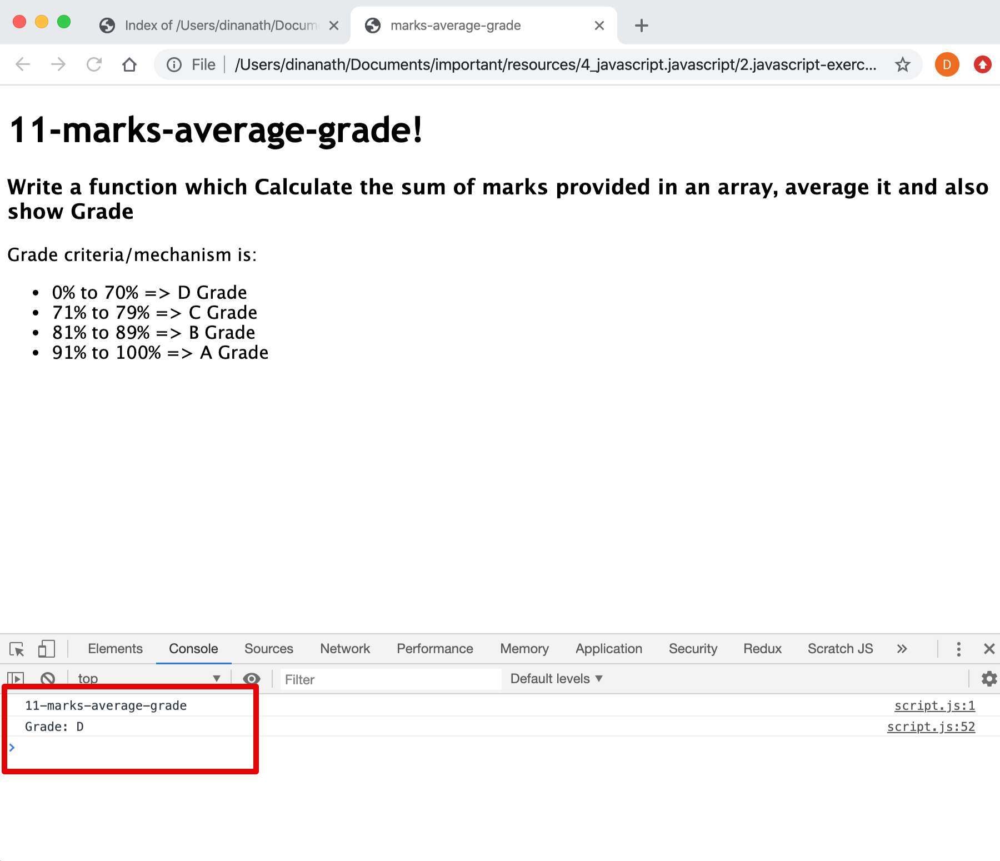
    <figcaption>&nbsp;&nbsp;&nbsp; Image 11 - Marks Average Grade</figcaption>
  </figure>
</p>

> **Syntax & Example**: `11-marks-average-grade.html`
```html

<!DOCTYPE html>
<html lang="en">
<head>
  <meta charset="UTF-8">
  <meta name="viewport" content="width=device-width, initial-scale=1.0">
  <title>marks-average-grade</title>
  <link rel="stylesheet" type="text/css" href="../style.css" />
</head>
<body> 
  
  <h1>11-marks-average-grade!</h1>

  <h3>Write a function which Calculate the sum of marks provided in an array, average it and also show Grade</h3>

  Grade criteria/mechanism is:
  <ul>
    <li>0% to 70% => D Grade</li>
    <li>71% to 79% => C Grade</li>
    <li>81% to 89% => B Grade</li>
    <li>91% to 100% => A Grade</li>
  </ul>

  <script type="text/javascript" src="script.js"></script>

</body>
</html>

```

> **Syntax & Example**: `script.js`
```js

console.log('11-marks-average-grade');

// approach 1

/* const MARKSARRAY = [55, 85, 55, 65];

function calculateAverageGrade(currentMarks) {
  let totalMarks = 0;
  let averageMarks = 0;
  let grade;

  for(let mark of currentMarks) {
    totalMarks += mark;
  }
  // console.log('totalMarks:', totalMarks);
  averageMarks = (totalMarks/currentMarks.length);
  // console.log('averageMarks:', averageMarks);

  if(averageMarks < 70) return grade = 'D'; 
  if(averageMarks < 80) return grade = 'C';
  if(averageMarks < 90) return grade = 'B';
  if(averageMarks <= 100) return grade = 'A';
}

console.log('Grade:', calculateAverageGrade(MARKSARRAY)); */

// approach 2 - create two different functions with single responsibility principle

const MARKSARRAY = [55, 85, 55, 65];

function calculateAverage(currentArray) {
  let total = 0;
  for (let curValue of currentArray) {
    total += curValue;
  }
  // console.log('total:', total);
  return (total/currentArray.length);
}

// console.log(calculateAverage(MARKSARRAY));

function calculateGrades(_currentArray) { 
  const average = calculateAverage(_currentArray);
  // console.log('average:', average);

  if(average < 70) return grade = 'D'; 
  if(average < 80) return grade = 'C';
  if(average < 90) return grade = 'B';
  if(average <= 100) return grade = 'A';
}

console.log('Grade:',calculateGrades(MARKSARRAY));

```

Example 12 Random Bingo Card
=====================

<p>
  <figure>
    &nbsp;&nbsp;&nbsp; 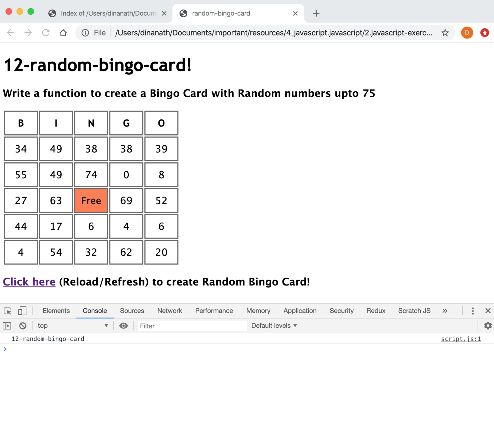
    <figcaption>&nbsp;&nbsp;&nbsp; Image 12 - Random Bingo Card</figcaption>
  </figure>
</p>

> **Syntax & Example**: `12-random-bingo-card.html`
```html

<!DOCTYPE html>
<html lang="en">
<head>
  <meta charset="UTF-8">
  <meta name="viewport" content="width=device-width, initial-scale=1.0">
  <title>random-bingo-card</title>
  <link rel="stylesheet" type="text/css" href="../style.css" />
</head>
<body> 
  
  <h1>12-random-bingo-card!</h1>
  
  <h3>Write a function to create a Bingo Card with Random numbers upto 75</h3>
  <table>
    <thead>
      <tr>
        <th class="heading">B</th>
        <th class="heading">I</th>
        <th class="heading">N</th>
        <th class="heading">G</th>
        <th class="heading">O</th>
      </tr>
    </thead>

    <tbody>
      <tr> 
        <td id="Square1">&nbsp;</td>
        <td id="Square2">&nbsp;</td>
        <td id="Square3">&nbsp;</td>
        <td id="Square4">&nbsp;</td>
        <td id="Square5">&nbsp;</td>
      </tr>
      <tr>
        <td id="Square6">&nbsp;</td>
        <td id="Square7">&nbsp;</td>
        <td id="Square8">&nbsp;</td>
        <td id="Square9">&nbsp;</td>
        <td id="Square10">&nbsp;</td>
      </tr>
      <tr>
        <td id="Square11">&nbsp;</td>
        <td id="Square12">&nbsp;</td>
        <td id="freeSquare">Free</td>
        <td id="Square13">&nbsp;</td>
        <td id="Square14">&nbsp;</td>
      </tr>
      <tr>
        <td id="Square15">&nbsp;</td>
        <td id="Square16">&nbsp;</td>
        <td id="Square17">&nbsp;</td>
        <td id="Square18">&nbsp;</td>
        <td id="Square19">&nbsp;</td>
      </tr>
      <tr>
        <td id="Square20">&nbsp;</td>
        <td id="Square21">&nbsp;</td>
        <td id="Square22">&nbsp;</td>
        <td id="Square23">&nbsp;</td>
        <td id="Square24">&nbsp;</td>
      </tr>
    </tbody>
  </table>

  <h3><a href="">Click here</a> (Reload/Refresh) to create Random Bingo Card!</h3>

  <script type="text/javascript" src="script.js"></script>

</body>
</html>

```

> **Syntax & Example**: `script.js`
```js

console.log('12-random-bingo-card');

window.onload = createBingoCard;

function createBingoCard() {
  // console.log('in createBingoCard');

  for (var i = 1; i <= 24; i++) {
    var newRandomNum = Math.floor(Math.random() * 75);
    // console.log('newRandomNum', newRandomNum);
    document.getElementById('Square' + i).innerHTML = newRandomNum;
  }
}

```

Example 13 Show Prime Numbers
=====================

<p>
  <figure>
    &nbsp;&nbsp;&nbsp; 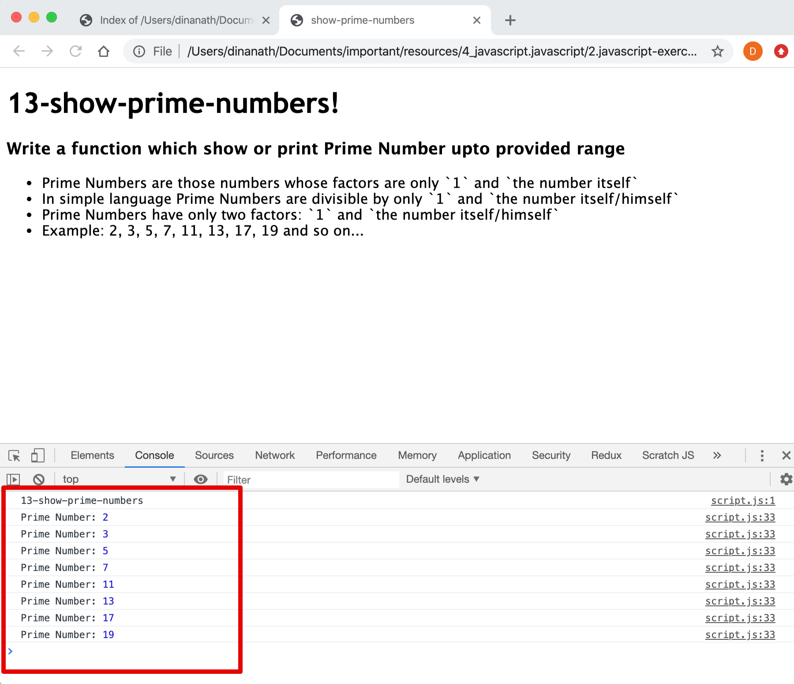
    <figcaption>&nbsp;&nbsp;&nbsp; Image 13 - Show Prime Numbers</figcaption>
  </figure>
</p>

> **Syntax & Example**: `13-show-prime-numbers.html`
```html

<!DOCTYPE html>
<html lang="en">
<head>
  <meta charset="UTF-8">
  <meta name="viewport" content="width=device-width, initial-scale=1.0">
  <title>show-prime-numbers</title>
  <link rel="stylesheet" type="text/css" href="../style.css" />
</head>
<body> 
  
  <h1>13-show-prime-numbers!</h1>

  <h3>Write a function which show or print Prime Number upto provided range</h3>

  <ul>
    <li>Prime Numbers are those numbers whose factors are only `1` and `the number itself`</li>
    <li>In simple language Prime Numbers are divisible by only `1` and `the number itself/himself`</li>
    <li>Prime Numbers have only two factors: `1` and `the number itself/himself`</li>
    <li>Example: 2, 3, 5, 7, 11, 13, 17, 19 and so on...</li>
  </ul>

  <script type="text/javascript" src="script.js"></script>

</body>
</html>

```

> **Syntax & Example**: `script.js`
```js

console.log('13-show-prime-numbers');

// approach 1

/* function showPrimeNumbers(numberLimit) {
  for (let curNum = 2; curNum <= numberLimit; curNum++) {
    // console.log('curNum', curNum);

    let isPrime = true;
    for (let factor = 2; factor < curNum; factor++) {
      // console.log('factor', factor);
      if (curNum % factor === 0) {
        isPrime = false;
        break;
      }
    }

    if (isPrime) {
      console.log('Prime Number', curNum);
      
    }
  }
} 

showPrimeNumbers(20);*/

// approach 2

function showPrimeNumbers(numberLimit) {
  for (let curNum = 2; curNum <= numberLimit; curNum++) {
    // console.log('curNum', curNum);
    if (isPrimeNumber(curNum)) {
      console.log('Prime Number:', curNum);
    }
  }
}

function isPrimeNumber(_number) {
  for (let factor = 2; factor < _number; factor++) {
    // console.log('factor', factor);
    if (_number % factor === 0) {
      return false;
    }
  }
  return true;
}

showPrimeNumbers(20);

```

Example 14 Sum Of Arguments
=====================

<p>
  <figure>
    &nbsp;&nbsp;&nbsp; 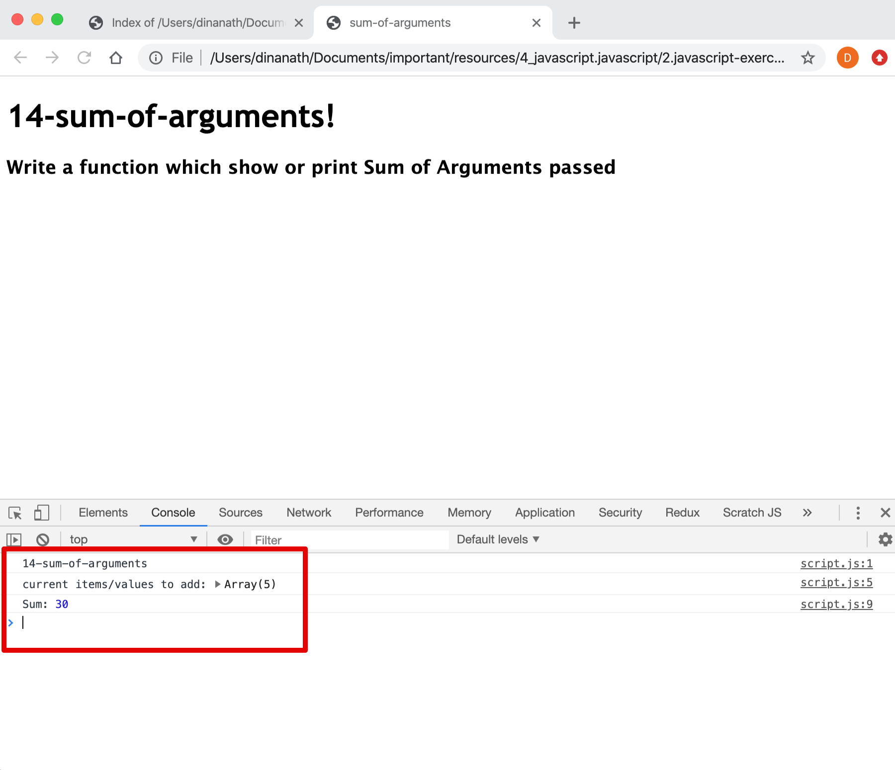
    <figcaption>&nbsp;&nbsp;&nbsp; Image 14 - Sum Of Arguments</figcaption>
  </figure>
</p>

> **Syntax & Example**: `14-sum-of-arguments.html`
```html

<!DOCTYPE html>
<html lang="en">
<head>
  <meta charset="UTF-8">
  <meta name="viewport" content="width=device-width, initial-scale=1.0">
  <title>sum-of-arguments</title>
  <link rel="stylesheet" type="text/css" href="../style.css" />
</head>
<body> 
  
  <h1>14-sum-of-arguments!</h1>

  <h3>Write a function which show or print Sum of Arguments passed</h3>

  <script type="text/javascript" src="script.js"></script>

</body>
</html>

```

> **Syntax & Example**: `script.js`
```js

console.log('14-sum-of-arguments');

function sumOfArguments(...items){
  // rest operator converts anything passed as an array
  console.log('current items/values to add:', items);
  return items.reduce((n1, n2) => n1 +n2);
}

console.log('Sum:', sumOfArguments(10, 2, 8, 4, 6));
// console.log('Sum:', sumOfArguments([10, 2, 8, 4, 6]));

```

Example 15 Sum Of Arguments Array
=====================

<p>
  <figure>
    &nbsp;&nbsp;&nbsp; 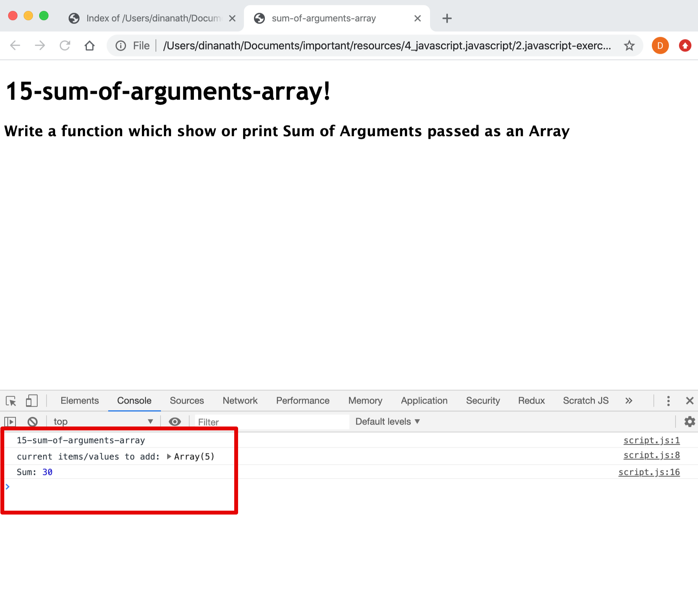
    <figcaption>&nbsp;&nbsp;&nbsp; Image 15 - Sum Of Arguments Array</figcaption>
  </figure>
</p>

> **Syntax & Example**: `15-sum-of-arguments-array.html`
```html

<!DOCTYPE html>
<html lang="en">
<head>
  <meta charset="UTF-8">
  <meta name="viewport" content="width=device-width, initial-scale=1.0">
  <title>sum-of-arguments-array</title>
  <link rel="stylesheet" type="text/css" href="../style.css" />
</head>
<body> 
  
  <h1>15-sum-of-arguments-array!</h1>

  <h3>Write a function which show or print Sum of Arguments passed as an Array</h3>

  <script type="text/javascript" src="script.js"></script>

</body>
</html>

```

> **Syntax & Example**: `script.js`
```js

console.log('15-sum-of-arguments-array');

function sumOfArguments(...items){
  // as rest operator converts anything passed as an array check following
  if(items.length === 1 && Array.isArray(items[0])) {
    // reset item as a new array 
    items = [...items[0]]
    console.log('current items/values to add:', items);
    return items.reduce((n1, n2) => n1 +n2);
  }
}

// pass arguments as an array
// console.log('Sum:', sumOfArguments([10, 2, 8, 4, 6]));
console.log('Sum:', sumOfArguments([10, 2, 8, 4, 6]));

```

Example 16 Circle Area Object Read Only Property
=====================

<p>
  <figure>
    &nbsp;&nbsp;&nbsp; 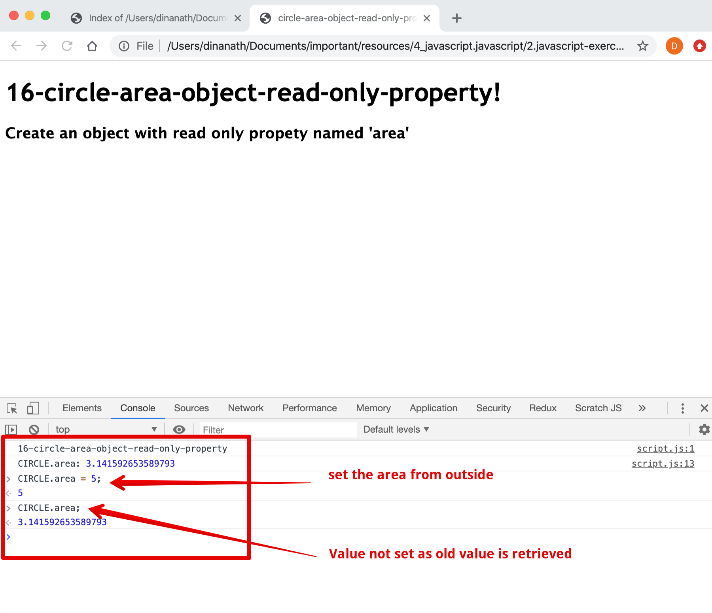
    <figcaption>&nbsp;&nbsp;&nbsp; Image 16 - Circle Area Object Read Only Property</figcaption>
  </figure>
</p>

> **Syntax & Example**: `16-circle-area-object-read-only-property.html`
```html

<!DOCTYPE html>
<html lang="en">
<head>
  <meta charset="UTF-8">
  <meta name="viewport" content="width=device-width, initial-scale=1.0">
  <title>circle-area-object-read-only-property</title>
  <link rel="stylesheet" type="text/css" href="../style.css" />
</head>
<body> 
  
  <h1>16-circle-area-object-read-only-property!</h1>

  <h3>Create an object with read only propety named 'area'</h3>

  <script type="text/javascript" src="script.js"></script>

</body>
</html>

```

> **Syntax & Example**: `script.js`
```js

console.log('16-circle-area-object-read-only-property');

const CIRCLE = {
  name: 'mainCircle',
  lineColor: 'red',
  bgColor: 'gray',
  radius: 1,
  get area() {
    return Math.PI * this.radius * this.radius;
  }
}

console.log('CIRCLE.area:', CIRCLE.area);

```

Example 17 Create Array From Argument Range
=====================

<p>
  <figure>
    &nbsp;&nbsp;&nbsp; 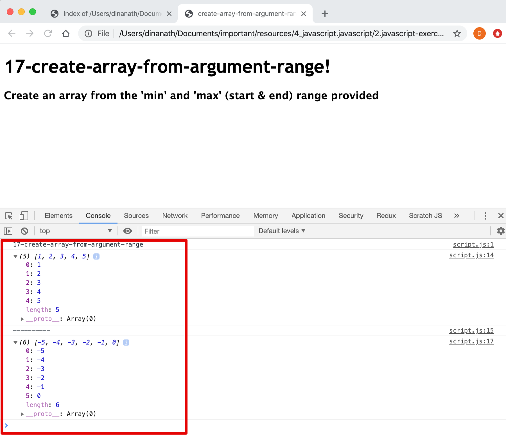
    <figcaption>&nbsp;&nbsp;&nbsp; Image 17 - Create Array From Argument Range</figcaption>
  </figure>
</p>

> **Syntax & Example**: `17-create-array-from-argument-range.html`
```html

<!DOCTYPE html>
<html lang="en">
<head>
  <meta charset="UTF-8">
  <meta name="viewport" content="width=device-width, initial-scale=1.0">
  <title>create-array-from-argument-range</title>
  <link rel="stylesheet" type="text/css" href="../style.css" />
</head>
<body> 
  
  <h1>17-create-array-from-argument-range!</h1>

  <h3>Create an array of the values from the 'min' and 'max' (start & end) range provided</h3>

  <script type="text/javascript" src="script.js"></script>

</body>
</html>

```

> **Syntax & Example**: `script.js`
```js

console.log('17-create-array-from-argument-range');

function generateArrayFromRange(startNum, endNum) {
  const rangeArray = [];
  for(let curNum = startNum; curNum <= endNum; curNum++) {
    // console.log('curNum: ', curNum);
    rangeArray.push(curNum);
    // console.log('rangeArray: ', rangeArray);
  }
  return rangeArray;
}

const range1 = generateArrayFromRange(1, 5);
console.log(range1);
console.log('----------');
const range2 = generateArrayFromRange(-5, 0);
console.log(range2);

```

Example 18 Array Includes Element Exists
=====================

<p>
  <figure>
    &nbsp;&nbsp;&nbsp; 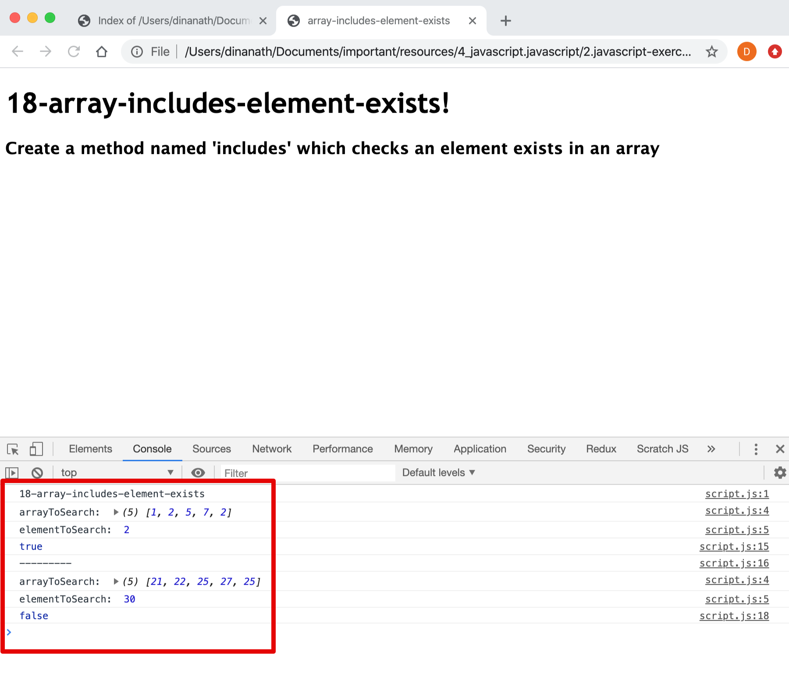
    <figcaption>&nbsp;&nbsp;&nbsp; Image 18 - Array Includes Element Exists</figcaption>
  </figure>
</p>

> **Syntax & Example**: `18-array-includes-element-exists.html`
```html

<!DOCTYPE html>
<html lang="en">
<head>
  <meta charset="UTF-8">
  <meta name="viewport" content="width=device-width, initial-scale=1.0">
  <title>array-includes-element-exists</title>
  <link rel="stylesheet" type="text/css" href="../style.css" />
</head>
<body> 
  
  <h1>18-array-includes-element-exists!</h1>

  <h3>Create a method named 'includes' which checks an element exists in an array</h3>

  <script type="text/javascript" src="script.js"></script>

</body>
</html>

```

> **Syntax & Example**: `script.js`
```js

console.log('18-array-includes-element-exists');

function includes(arrayToSearch, elementToSearch) {
  console.log('arrayToSearch: ', arrayToSearch);
  console.log('elementToSearch: ', elementToSearch);
  for(let curElement of arrayToSearch) {
    if(curElement === elementToSearch) {
      return true;
    } 
  }
  return false;
}

const versionArray = [1, 2, 5, 7, 2];
console.log(includes(versionArray, 2));
console.log('---------');
const ageArray = [21, 22, 25, 27, 25];
console.log(includes(ageArray, 30));

```

Example 19 Array Excludes Value To New Array
=====================

<p>
  <figure>
    &nbsp;&nbsp;&nbsp; 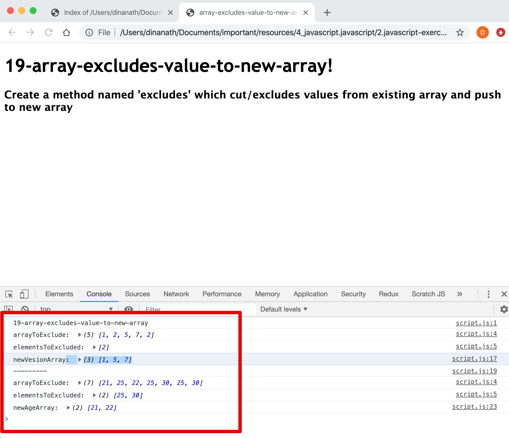
    <figcaption>&nbsp;&nbsp;&nbsp; Image 19 - Array Excludes Value To New Array</figcaption>
  </figure>
</p>

> **Syntax & Example**: `19-array-excludes-value-to-new-array.html`
```html

<!DOCTYPE html>
<html lang="en">
<head>
  <meta charset="UTF-8">
  <meta name="viewport" content="width=device-width, initial-scale=1.0">
  <title>array-excludes-value-to-new-array</title>
  <link rel="stylesheet" type="text/css" href="../style.css" />
</head>
<body> 
  
  <h1>19-array-excludes-value-to-new-array!</h1>

  <h3>Create a method named 'excludes' which cut/excludes values from existing array and push to new array</h3>

  <script type="text/javascript" src="script.js"></script>

</body>
</html>

```

> **Syntax & Example**: `script.js`
```js

console.log('19-array-excludes-value-to-new-array');

function excludes(arrayToExclude, elementsToExcluded) {
  console.log('arrayToExclude: ', arrayToExclude);
  console.log('elementsToExcluded: ', elementsToExcluded);
  const outputArray = [];
  for(let curElement of arrayToExclude) {
    if(!elementsToExcluded.includes(curElement)) {
      outputArray.push(curElement)
    }
  }
  return outputArray;
}

const versionArray = [1, 2, 5, 7, 2];
const newVesionArray = (excludes(versionArray, [2]));
console.log('newVesionArray: ', newVesionArray);

console.log('---------');

const ageArray = [21, 25, 22, 25, 30, 25, 30];
const newAgeArray = (excludes(ageArray, [25,30]));
console.log('newAgeArray: ', newAgeArray);

```

Example 20 Array Count Search Occurances
=====================

<p>
  <figure>
    &nbsp;&nbsp;&nbsp; 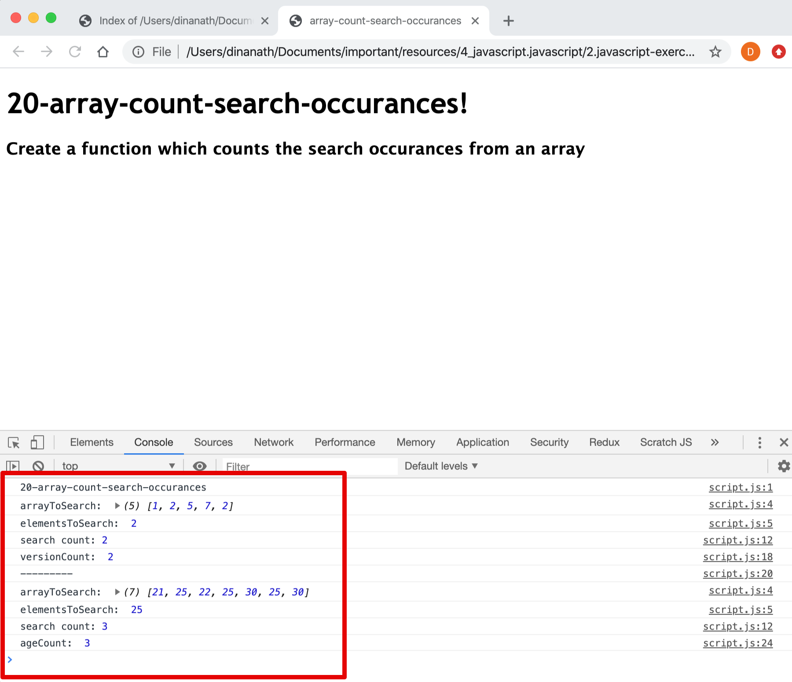
    <figcaption>&nbsp;&nbsp;&nbsp; Image 20-01 - Array Count Search Occurances</figcaption>
  </figure>
</p>

> **Syntax & Example**: `array-count-search-occurances.html`
```html

<!DOCTYPE html>
<html lang="en">
<head>
  <meta charset="UTF-8">
  <meta name="viewport" content="width=device-width, initial-scale=1.0">
  <title>array-count-search-occurances</title>
  <link rel="stylesheet" type="text/css" href="../style.css" />
</head>
<body> 
  
  <h1>20-array-count-search-occurances!</h1>

  <h3>Create a function which counts the search occurances from an array</h3>

  <script type="text/javascript" src="script.js"></script>

</body>
</html>

```

> **Syntax & Example**: `script.js`
```js

console.log('20-array-count-search-occurances');

// approach 1
/* function countSearchOccurances(arrayToSearch, elementsToSearch) {
  // console.log('arrayToSearch: ', arrayToSearch);
  // console.log('elementsToSearch: ', elementsToSearch);
  let count = 0;
  for(let curElement of arrayToSearch) {
    if(curElement === elementsToSearch) {
      count++;
    }
  }
  // console.log('search count:', count);
  return count;
} */

// approach 2 
function countSearchOccurances(arrayToSearch, elementsToSearch) {

  return arrayToSearch.reduce((countAccumulator, curentSearchElement) => {
    let countOccurances = (curentSearchElement === elementsToSearch) ? 1 : 0;
    // console.log('countAccumulator', countAccumulator, 'arrayToSearch', arrayToSearch, 'elementsToSearch', elementsToSearch,);
    return countAccumulator + countOccurances;
  },0)
}

const versionArray = [1, 2, 5, 7, 2];
const versionCount = (countSearchOccurances(versionArray, 2));
console.log('versionCount: ', versionCount);

console.log('---------');

const ageArray = [21, 25, 22, 25, 30, 25, 30];
const ageCount = (countSearchOccurances(ageArray, -25));
console.log('ageCount: ', ageCount);

```

<p>
  <figure>
    &nbsp;&nbsp;&nbsp; 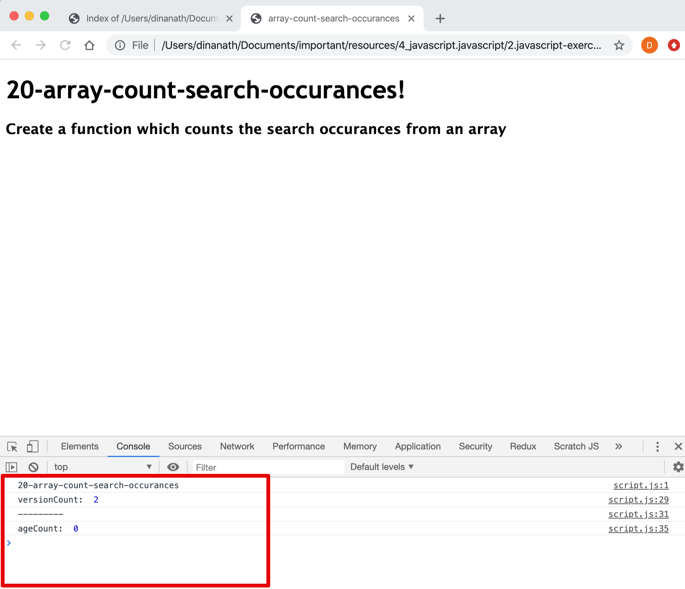
    <figcaption>&nbsp;&nbsp;&nbsp; Image 20-02 - Array Count Search Occurances</figcaption>
  </figure>
</p>

Example 21 - Array Get Max Largest Number
=====================

<p>
  <figure>
    &nbsp;&nbsp;&nbsp; 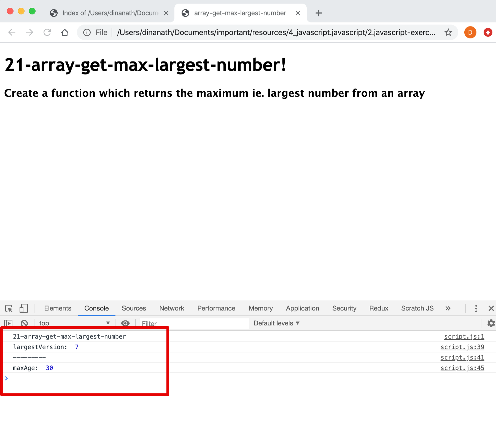
    <figcaption>&nbsp;&nbsp;&nbsp; Image 21 - Array Get Max Largest Number</figcaption>
  </figure>
</p>

> **Syntax & Example**: `21-array-get-max-largest-number.html`
```html

<!DOCTYPE html>
<html lang="en">

<head>
  <meta charset="UTF-8">
  <meta name="viewport" content="width=device-width, initial-scale=1.0">
  <title>array-get-max-largest-number</title>
  <link rel="stylesheet" type="text/css" href="../style.css" />
</head>

<body>

  <h1>21-array-get-max-largest-number!</h1>

  <h3>Create a function which returns the maximum ie. largest number from an array</h3>

  <script type="text/javascript" src="script.js"></script>

</body>

</html>

```

> **Syntax & Example**: `script.js`
```js

console.log('21-array-get-max-largest-number');

// approach 1
/* 
function getLargestNumber(arrayToSearch) {
  if (arrayToSearch.length <= 0) return 'Array is Empty! Nothing to search!!';
  let largetNumber = arrayToSearch[0];

  for (let i = 1; i < arrayToSearch.length; i++) {
    if (arrayToSearch[i] > largetNumber) {
      largetNumber = arrayToSearch[i];
    }
  }
  return largetNumber;
} 

const versionArray = [5, 2, 3, 4, 7];
const largestVersion = (getLargestNumber(versionArray));
console.log('largestVersion: ', largestVersion);

console.log('---------');

const ageArray = [21, 25, 22, 25, 30, 25, 30];
const maxAge = (getLargestNumber(ageArray));
console.log('maxAge: ', maxAge); */

// approach 2 

function getLargestNumber(arrayToSearch) {
  if (arrayToSearch.length <= 0) return 'Array is Empty! Nothing to search!!';

  return arrayToSearch.reduce((largetNumber, curentSearchElement) => {
    return (curentSearchElement > largetNumber) ? curentSearchElement : largetNumber;
  })
}

const versionArray = [5, 2, 3, 4, 7];
const largestVersion = (getLargestNumber(versionArray));
console.log('largestVersion: ', largestVersion);

console.log('---------');

const ageArray = [21, 25, 22, 25, 30, 25, 30];
const maxAge = (getLargestNumber(ageArray));
console.log('maxAge: ', maxAge);

```

Example 22 Array Filter Sort Map
=====================

<p>
  <figure>
    &nbsp;&nbsp;&nbsp; 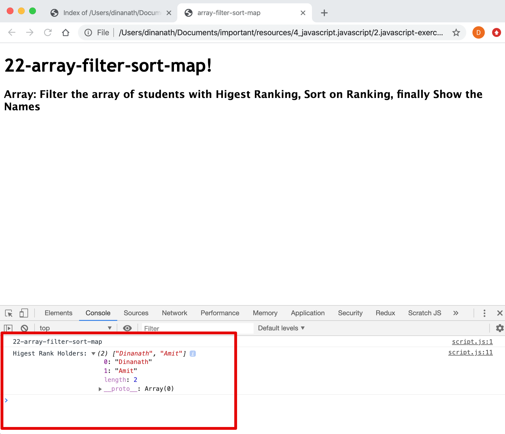
    <figcaption>&nbsp;&nbsp;&nbsp; Image 22 - Array Filter Sort Map</figcaption>
  </figure>
</p>

> **Syntax & Example**: `22-array-filter-sort-map.html`
```html

<!DOCTYPE html>
<html lang="en">

<head>
  <meta charset="UTF-8">
  <meta name="viewport" content="width=device-width, initial-scale=1.0">
  <title>array-filter-sort-map</title>
  <link rel="stylesheet" type="text/css" href="../style.css" />
</head>

<body>

  <h1>22-array-filter-sort-map!</h1>

  <h3>Array: Filter the array of students with Higest Ranking, Sort on Ranking, finally Show the Names </h3>

  <script type="text/javascript" src="script.js"></script>

</body>

</html>

```

> **Syntax & Example**: `script.js`
```js

console.log('22-array-filter-sort-map');

const studentsArray = [
  { name: 'Suraj', year: 2019, ranking: 4 },
  { name: 'Amit', year: 2019, ranking: 5 },
  { name: 'Akash', year: 2018, ranking: 4 },
  { name: 'Dinanath', year: 2019, ranking: 7 },
  { name: 'Sagar', year: 2017, ranking: 3 },
]

console.log('Higest Rank Holders:',
  studentsArray
    .filter(student => student.year === 2019 && student.ranking >= 5)
    .sort((n1, n2) => n1.ranking - n2.ranking)
    .reverse()
    .map(student => student.name)
);

```

Example 23 Object Create Students and Address Object
=====================

<p>
  <figure>
    &nbsp;&nbsp;&nbsp; 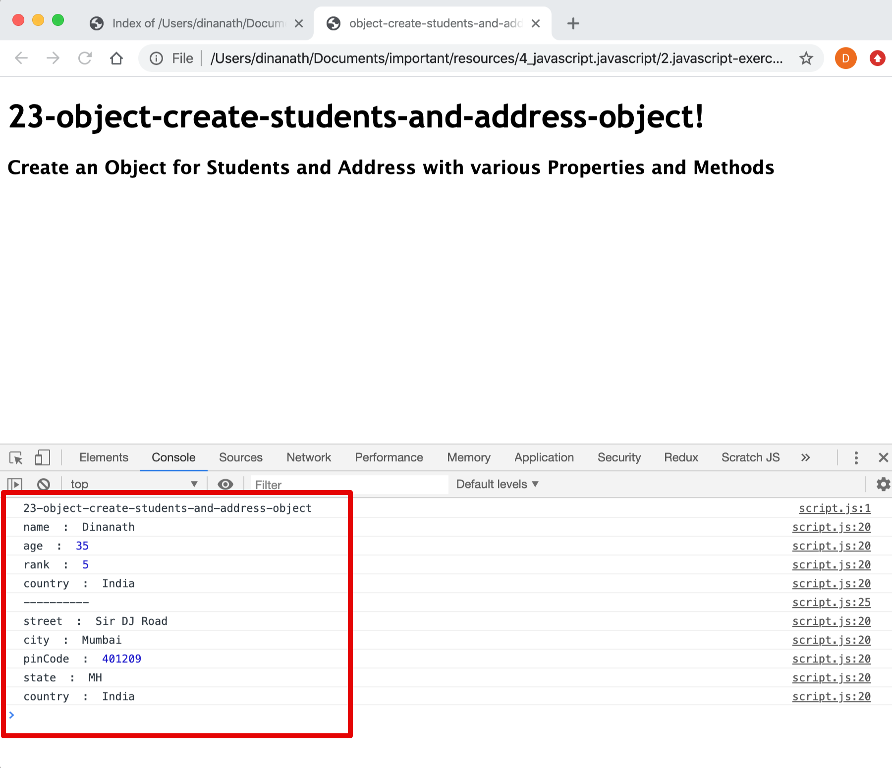
    <figcaption>&nbsp;&nbsp;&nbsp; Image 23 - Object Create Students and Address Object</figcaption>
  </figure>
</p>

> **Syntax & Example**: `23-object-create-students-and-address-object.html`
```html

<!DOCTYPE html>
<html lang="en">

<head>
  <meta charset="UTF-8">
  <meta name="viewport" content="width=device-width, initial-scale=1.0">
  <title>object-create-students-and-address-object</title>
  <link rel="stylesheet" type="text/css" href="../style.css" />
</head>

<body>

  <h1>23-object-create-students-and-address-object!</h1>

  <h3>Create an Object for Students and Address with various Properties and Methods </h3>

  <script type="text/javascript" src="script.js"></script>

</body>

</html>

```

> **Syntax & Example**: `script.js`
```js

console.log('23-object-create-students-and-address-object');

const Students = {
  name: 'Dinanath',
  age: 35,
  rank: 5,
  country: 'India',
}

const Address = {
  street: 'Sir DJ Road',
  city: 'Mumbai',
  pinCode: 401209,
  state: 'MH',
  country: 'India',
}

function showObjectDetails(obj) {
  for(let key in obj) {
    console.log(key,' : ',obj[key]);
  }
}

showObjectDetails(Students);
console.log('----------');
showObjectDetails(Address);

```

Example 24 Object Create Object Factory Constructor Function
=====================

<p>
  <figure>
    &nbsp;&nbsp;&nbsp; 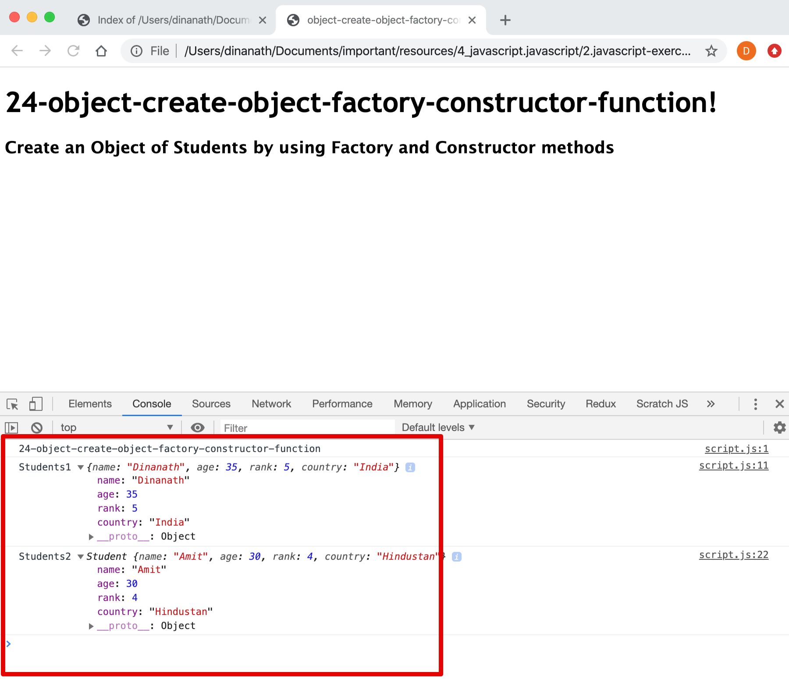
    <figcaption>&nbsp;&nbsp;&nbsp; Image 24 - Object Create Object Factory Constructor Function</figcaption>
  </figure>
</p>

> **Syntax & Example**: `24-object-create-object-factory-constructor-function.html`
```html

<!DOCTYPE html>
<html lang="en">

<head>
  <meta charset="UTF-8">
  <meta name="viewport" content="width=device-width, initial-scale=1.0">
  <title>object-create-object-factory-constructor-function</title>
  <link rel="stylesheet" type="text/css" href="../style.css" />
</head>

<body>

  <h1>24-object-create-object-factory-constructor-function!</h1>

  <h3>Create an Object of Students by using Factory and Constructor methods</h3>

  <script type="text/javascript" src="script.js"></script>

</body>

</html>

```

> **Syntax & Example**: `script.js`
```js

console.log('24-object-create-object-factory-constructor-function');

// Factory function/method - camelCasing - camel notation - use return keyword
function createObjFactoryMethod(name, age, rank, country) {
  return {
    name, age, rank, country
  }
}

let Students1 = createObjFactoryMethod('Dinanath', 35, 5, 'India');
console.log('Students1', Students1);

// Constructor function/method - pascalCasing - pascal notation - use this keyword
function Student(name, age, rank, country) {
  this.name = name;
  this.age = age;
  this.rank = rank;
  this.country = country;
}

let Students2 = new Student('Amit', 30, 4, 'Hindustan');
console.log('Students2', Students2);

```

Example 25 Object Equality
=====================

<p>
  <figure>
    &nbsp;&nbsp;&nbsp; 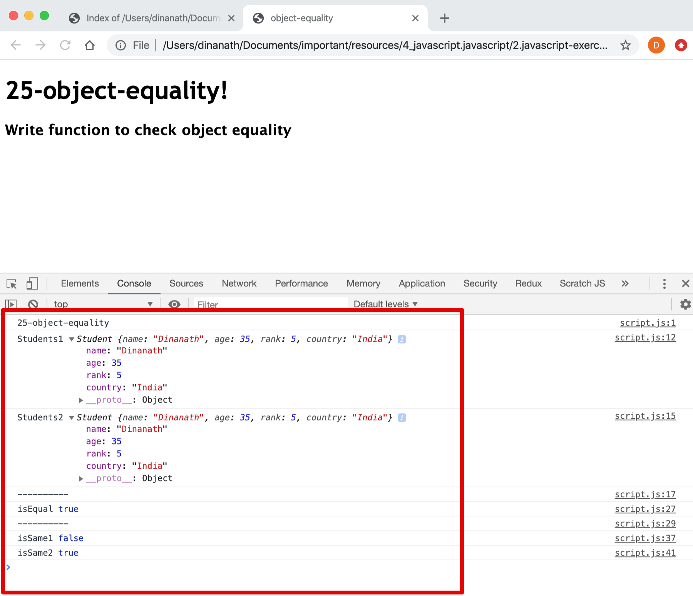
    <figcaption>&nbsp;&nbsp;&nbsp; Image 25 - Object Equality</figcaption>
  </figure>
</p>

> **Syntax & Example**: `25-object-equality.html`
```html

<!DOCTYPE html>
<html lang="en">

<head>
  <meta charset="UTF-8">
  <meta name="viewport" content="width=device-width, initial-scale=1.0">
  <title>object-equality</title>
  <link rel="stylesheet" type="text/css" href="../style.css" />
</head>

<body>

  <h1>25-object-equality!</h1>

  <h3>Write function to check object equality</h3>

  <script type="text/javascript" src="script.js"></script>

</body>

</html>

```

> **Syntax & Example**: `script.js`
```js

console.log('25-object-equality');

// Constructor function/method - pascalCasing - pascal notation - use this keyword
function Student(name, age, rank, country) {
  this.name = name;
  this.age = age;
  this.rank = rank;
  this.country = country;
}

let Students1 = new Student('Dinanath', 35, 5, 'India');
console.log('Students1', Students1);

let Students2 = new Student('Dinanath', 35, 5, 'India');
console.log('Students2', Students2);

console.log('----------');

// Objects are reference type, objects can have same properties but they are from different memeory location, they can be equal if both objects have same properties
function isObjectEqual(obj1, obj2){
  return obj1.name === obj2.name &&
         obj1.age === obj2.age &&
         obj1.rank === obj2.rank &&
         obj1.country === obj2.country
}

console.log('isEqual', isObjectEqual(Students1, Students2));

console.log('----------');

// Objects are same if both are pointed to same object
function isObjectPointSame(obj1, obj2){
  return obj1 === obj2;
}

let isSame1 = isObjectPointSame(Students1, Students2);
console.log('isSame1', isSame1);

let Students3 = Students2;
let isSame2 = isObjectPointSame(Students2, Students3);
console.log('isSame2', isSame2);

```
